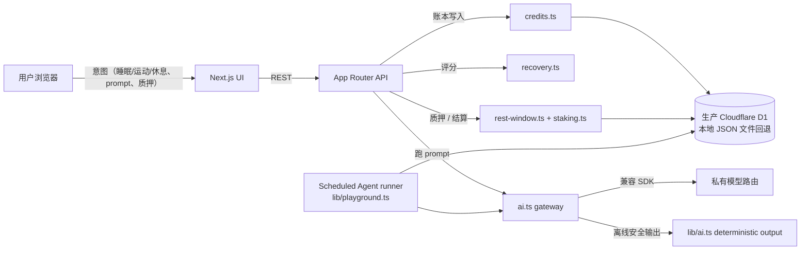

# 架构

## 概览

Good Night Credits 是一个 Next.js 15 App Router 项目，分五层：

1. **UI**——`src/app/` 下的 App Router 路由（落地页 + `/app` 下登录后的应用壳）。
2. **Credits 引擎**——`src/lib/` 中的纯 TypeScript 领域逻辑（不绑死框架）。
3. **设备导入**——`src/lib/devices.ts` 解析 Apple Health、Fitbit、Oura、Google Fit 的 CSV/JSON 导出，并把可信健康输入写成当日 HealthEntry。
4. **私有模型网关**——`src/lib/providers.ts` 只在服务端发现、分层、路由模型；对用户只公开模型 ID。
5. **兼容 `/v1` 接口**——`/api/v1/chat/completions`、`/api/v1/messages`、`/v1/messages` 校验 `gnc_live_*`，执行资格门禁，扣钱包并转发。



Gateway 与回退之间那条虚线，让产品走查在现场网络不稳定时仍然可审阅；真实路由和服务端密钥不暴露给浏览器。

## 数据模型

本地开发使用 `data/runtime/store.json`，便于快速迭代。Cloudflare 生产环境在每个请求开始时从 D1 的 `gnc_store` 行恢复同一个 `DBShape`，并通过 `src/lib/store.ts` 写回。API 模块仍然读写普通 TypeScript 对象，存储边界集中在 store 层。

| 表 | 作用 | 所属模块 |
| -- | --- | -------- |
| `users` | 身份 + 时区 | `store.ts` |
| `settings` | 休息窗口、allowance、agent budget、guided mode | `store.ts` |
| `health` | 派生的睡眠/运动/休息输入（原始日志永远不存） | `recovery.ts` |
| `recovery` | 每日评分明细 + bonus 金额 | `recovery.ts` |
| `ledger` | 每笔 credits 变更，幂等 + append-only | `credits.ts` |
| `tokenEvents` | 每次 AI 调用（usage type、source、是否在 rest window、prompt 哈希） | `playground.ts` |
| `restWindows` | 每个窗口的状态 + 手动/Agent 用量 + 奖励 | `rest-window.ts` |
| `restStakes` | active / 完成的质押 + yield rate | `staking.ts` |
| `agentJobs` | scheduled / running / completed 的 AI agent job | `playground.ts` |
| `meta.streak` | 每用户的连续天数（影响乘数） | `store.ts` |

## 关键流程

### 1. 健康输入 → 信用

1. 用户提交 `/api/health`（preset 或手填）。
2. `recovery.recalculateRecovery` 重算评分。
3. `recovery.issueHealthBonuses` 幂等地写入 sleep / movement / break bonus——每天每种最多一次。
4. UI 通过 `useApp` snapshot 刷新。

### 2. Compute Curfew 结算

1. 用户按 **Start Rest Session**。
2. `rest-window.startWindow` 将即将到来的窗口翻为 `active`；本地快速审阅可以压缩 endTime。
3. `/api/curfew action=settle` 调 `rest-window.settleWindow`：
   - 汇总窗口内的 `tokenEvents`。
   - 计算 `complianceMultiplier`（1.0 / 0.5 / 0）。
   - 应用 streak 乘数，**12,000 cr 上限**。
   - 向账本写入 `curfew_bonus`。
   - 调 `staking.settleStakeForWindow` 返还本金 +（也许）发收益。

### 3. Rest Staking

1. `/api/staking action=create` 调 `staking.createStake`：检查余额，向账本写 `staking_lock`(-amount)，标记 stake 为 `active`。
2. `staking.settleStakeForWindow` 在 curfew 结算内运行：
   - 永远 append `staking_return`(+amount)。
   - 如果完全合规且未紧急解锁，则 append `staking_yield`，每日最多 10,000 cr。
3. 紧急解锁：只返本金，标记为 `unlocked`。

### 4. Playground 运行

1. `/api/playground` 用 Zod 校验 tool + prompt（最多 4,000 字符）。
2. 若处于 rest window 且客户端未确认，返回 409 + 清晰的休息窗口提示。
3. 否则：调 `playground.runPlaygroundTool`：
   - `ai.complete` 走服务端模型网关或返回确定性离线输出。
   - 写入 `token_events`，标记 `usageType=manual`、`isDuringRestWindow`。
   - 按固定档位扣账本。

### 5. Agent While You Sleep

1. `/api/agent-jobs action=create` 写入 `agentJobs`。
2. Guided mode 中由客户端 run-now 触发；生产调度设计为从 Cloudflare Worker 表面运行。
3. `playground.runAgentJob` 翻 `running`，调 gateway，`usageType=agent`。Agent usage 不影响 curfew bonus。

## 安全边界

- **Gateway operator keys**：服务端网关 URL 和密钥只在服务端环境中读取，永远不会在 client component 中 import；用户只拿到 `gnc_live_*` 钱包 key 和公开模型名。
- **无链上钱包**：Credits 是内部使用账本，不可提现、不可交易。
- **健康数据**：仅持久化派生分数。原始心率、GPS、设备遥测从不经过 wire。第一次手动提交前会显示 consent 文案。
- **Prompt 隐私**：`token_events` 中只存 `promptHash`（DJB2 short-hash），不存 body。Body 仅存在于浏览器内存中，导航离开即丢弃。
- **DELETE 端点**：`/api/health DELETE` 清掉演示用户的所有派生数据；Settings → "Delete my health data" 暴露同一操作。
- **限流**：当前公开网关会校验钱包 key 与余额。面向更大范围开放前，可在 `/v1` 网关前叠加 Cloudflare 原生限流。

## 取舍

- **没有真实鉴权。** 本地版本跑在 seeded user 上。接 Clerk / Auth.js 是下一步生产化工作。
- **D1 快照存储。** 生产环境用单个 D1 行保存规范化应用快照，保持实现轻量。高流量版本可以把热点表拆成独立 D1 表，不改变路由合约。
- **部分流式响应。** `/v1/messages` 支持 Claude 风格 SSE；App 内 Playground 仍是一次性响应。
- **没有原生 HealthKit Web OAuth。** Apple Health 走文件导入；Fitbit、Oura、Google Fit 共享 OAuth-shaped connect path。
- **没有 Weekend Yield UI。** `credits.ts` 已定义 `weekend_yield` 类型，但没有页面承载，是单页面 + cron 的工作量。

## 奖励公式

```
Sleep Score    = duration_score * 0.6 + quality_score * 0.4
Sleep Bonus    = (Sleep Score / 100) * 8,000

Movement Score = min(steps/8000, 1)*60 + min(active_minutes/30, 1)*40
Movement Bonus = (Movement Score / 100) * 4,000

Break Score    = min(break_count/3, 1)*50 + min(total_break_minutes/45, 1)*50
Break Bonus    = (Break Score / 100) * 3,000

Curfew Bonus   = min(rest_hours * 1000, 12,000)
               * compliance_multiplier  // 1.0 / 0.5 / 0
               * streak_multiplier      // 1.0 / 1.1 / 1.25 / 1.35

Stake Yield    = min(amount * yield_rate, 10,000)
Recovery Total = sleep*0.35 + movement*0.20 + break*0.20 + ai_rhythm*0.25
Shipping Score = recovery*0.5 + credits_earned*0.0005 + streak*5
```

每日 / 每周上限防止 credits 通胀：50,000 / 天，250,000 / 周，强制在 `credits.addCredits` 内执行。
